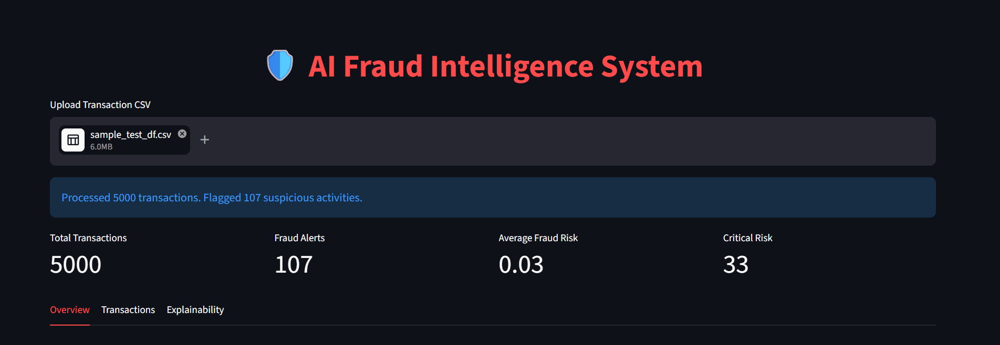
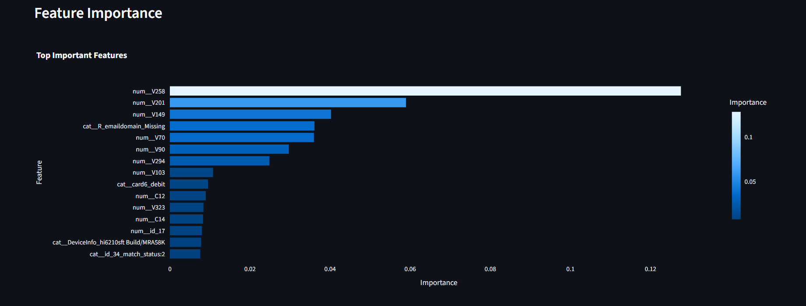
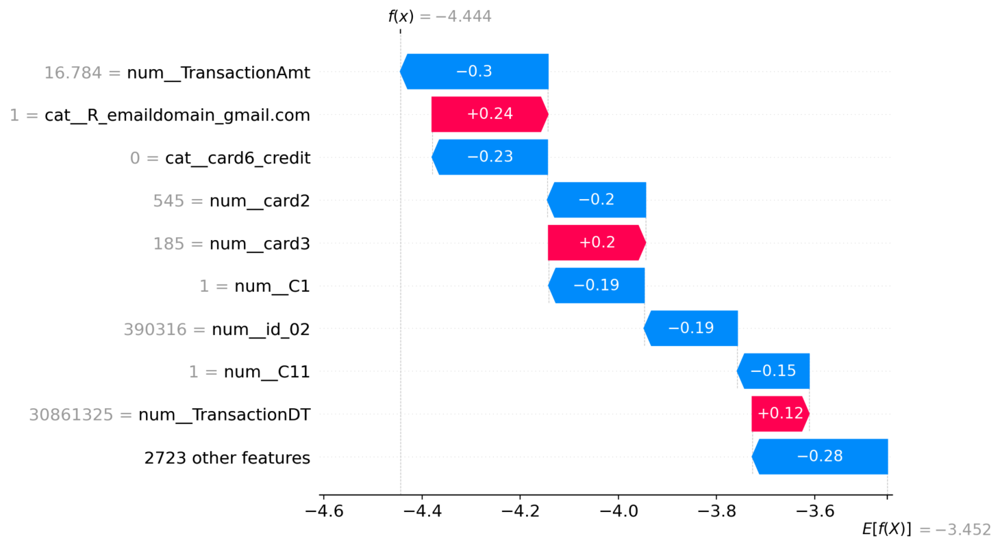
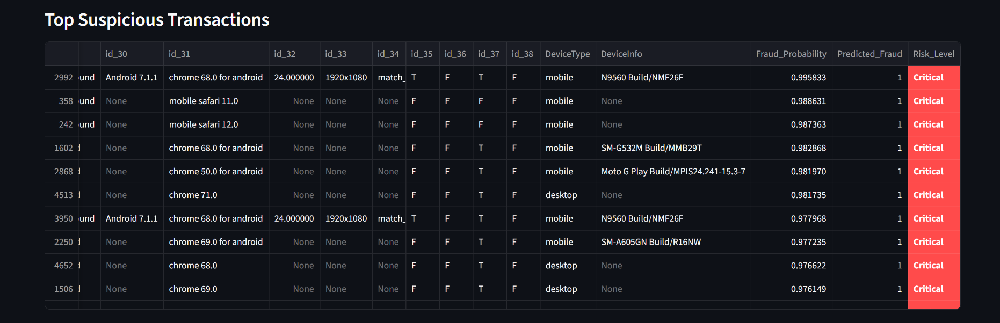
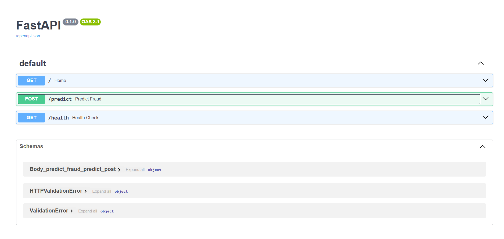

# AI Fraud Intelligence & Risk Scoring Platform


## End-to-End ML Engineering Project for Real-Time Financial Fraud Detection


# Overview

The **AI Fraud Intelligence & Risk Scoring Platform** is a production-style machine learning system designed to detect suspicious financial transactions in real time using advanced fraud detection techniques.

Unlike beginner ML projects, this system demonstrates:

* end-to-end ML engineering,
* explainable AI,
* API integration,
* Dockerized deployment,
* interactive analytics dashboards,
* fraud risk scoring,
* production-oriented architecture.

This project simulates how modern fintech fraud intelligence systems operate in real-world environments.

---

# Business Problem

Financial institutions lose billions of dollars annually due to:

* payment fraud,
* account takeovers,
* identity abuse,
* transaction manipulation,
* suspicious behavioral activity.

The objective of this system is to:

# detect fraudulent transactions in real time

while minimizing false positives and maximizing fraud detection accuracy.

---

# Key Features

## Fraud Detection Engine

* XGBoost-based fraud classification pipeline
* Probability-based fraud scoring
* Configurable fraud thresholds

---

## Risk Intelligence System

Each transaction receives:

* fraud probability,
* fraud prediction,
* risk level classification.

Risk levels:

* Low
* Medium
* High
* Critical

---

## Explainable AI (SHAP)

Integrated SHAP explainability to:

* explain why transactions were flagged,
* visualize feature contributions,
* improve model transparency.

---

## Interactive Dashboard

Built with Streamlit:

* CSV upload support
* live fraud analysis
* KPI monitoring
* risk analytics
* feature importance visualization
* fraud explanation interface

---

## FastAPI Backend

Production-style REST API:

* real-time inference endpoint
* scalable prediction architecture
* Docker-compatible backend service

---

## Dockerized Architecture

Full containerized deployment using:

* Docker
* Docker Compose

Supports:

* reproducibility,
* isolated environments,
* production-style orchestration.

---

# System Architecture

```text id="u61eq8"
┌────────────────────┐
│  Transaction CSV   │
└─────────┬──────────┘
          │
          ▼
┌────────────────────┐
│ Streamlit Dashboard│
└─────────┬──────────┘
          │ API Request
          ▼
┌────────────────────┐
│    FastAPI API     │
└─────────┬──────────┘
          │
          ▼
┌────────────────────┐
│ XGBoost ML Pipeline│
└─────────┬──────────┘
          │
          ▼
┌────────────────────┐
│ Fraud Predictions  │
│ Risk Scoring       │
│ SHAP Explanations  │
└────────────────────┘
```

---

# Machine Learning Pipeline

## Dataset

The project uses the:

### IEEE-CIS Fraud Detection Dataset

This dataset contains:

* transactional features,
* behavioral patterns,
* identity information,
* high-dimensional fraud signals.

---

## Data Processing

The pipeline includes:

* missing value handling,
* categorical encoding,
* preprocessing pipelines,
* feature engineering,
* scalable transformations.

---

## Modeling

Implemented:

* XGBoost classifier
* probability-based fraud scoring

Chosen because:

* excellent performance on tabular data,
* strong fraud detection capability,
* industry adoption in fintech systems.

---

## Imbalanced Learning

Fraud datasets are highly imbalanced.

Handled using:

* threshold tuning,
* probability calibration,
* business-aware evaluation metrics.

---

# Explainable AI

This system integrates:

## SHAP (SHapley Additive Explanations)

SHAP enables:

* transaction-level explanations,
* feature contribution visualization,
* model transparency for fraud analysts.

Example explanation:

```text id="v9ppp7"
High transaction amount
+ risky device
+ unusual behavioral pattern
→ elevated fraud probability
```

---

# Dashboard Features

## KPI Metrics

* Total transactions
* Fraud alerts
* Average fraud probability
* Critical-risk transaction count

---

## Interactive Visualizations

* Risk distribution charts
* Fraud probability histograms
* Feature importance analysis
* SHAP waterfall plots

---

## CSV Export

Download prediction results directly from dashboard.

---

# Dashboard Preview

---

## Main Dashboard



---

## Feature Importance Analysis



---

## SHAP Explainability



---

## Suspicious Transaction Intelligence



---

## FastAPI API Documentation



---

# API Endpoints

## Base Endpoint

```http id="3a2kz5"
GET /
```

Response:

```json id="b9shh9"
{
  "message": "Fraud Detection API Running"
}
```

---

## Prediction Endpoint

```http id="6rt2my"
POST /predict
```

Input:

* transaction CSV file

Output:

```json id="ry0zj5"
[
  {
    "Fraud_Probability": 0.91,
    "Predicted_Fraud": 1,
    "Risk_Level": "Critical"
  }
]
```

---

# Tech Stack

| Category                | Technology     |
| ----------------------- | -------------- |
| Language                | Python         |
| Machine Learning        | XGBoost        |
| Data Processing         | Pandas, NumPy  |
| Explainability          | SHAP           |
| Backend API             | FastAPI        |
| Dashboard               | Streamlit      |
| Visualization           | Plotly         |
| Deployment              | Docker         |
| Container Orchestration | Docker Compose |

---

# Dockerized Deployment

## Build Containers

```bash id="r1x6wd"
docker-compose build
```

---

## Start Services

```bash id="kw8p4w"
docker-compose up
```

---

## Access Applications

### Streamlit Dashboard

```text id="j6v99n"
http://localhost:8501
```

### FastAPI Docs

```text id="g0c4yw"
http://localhost:8000/docs
```

---

# Project Structure

```text id="jdr1m7"
project/
│
├── api/
│   └── main.py
│
├── dashboard/
│   └── app.py
│
├── models/
│   └── xgboost_pipeline.pkl
│
├── notebooks/
│
├── data/
│
├── Dockerfile
├── docker-compose.yml
├── requirements.txt
├── .dockerignore
└── README.md
```

---

# Model Evaluation

The model was evaluated using:

* ROC-AUC
* Precision
* Recall
* F1-score
* PR-AUC

The system prioritizes:

# fraud recall while balancing false positives.

This reflects real-world fraud detection business requirements.

---

# Production Engineering Features

This project demonstrates:

* ML pipeline engineering,
* API-based inference,
* explainable AI,
* Dockerized deployment,
* interactive analytics,
* scalable architecture,
* production-oriented design.

---

# Future Improvements

Potential enterprise extensions include:

## Real-Time Streaming

* Kafka integration
* live transaction scoring

---

## Deep Learning Fraud Detection

* autoencoders
* anomaly detection systems

---

## Graph-Based Fraud Detection

* fraud ring detection
* connected suspicious entity analysis

---

## LLM Fraud Analyst Assistant

Use GenAI systems to:

* summarize suspicious activity,
* explain fraud patterns,
* assist fraud investigators.

---

# Why This Project Stands Out

Unlike beginner ML projects, this system demonstrates:

* production ML engineering,
* deployment architecture,
* explainable AI,
* scalable APIs,
* real-world fraud analytics,
* fintech-oriented problem solving.

This project resembles:

# modern enterprise fraud intelligence systems.
